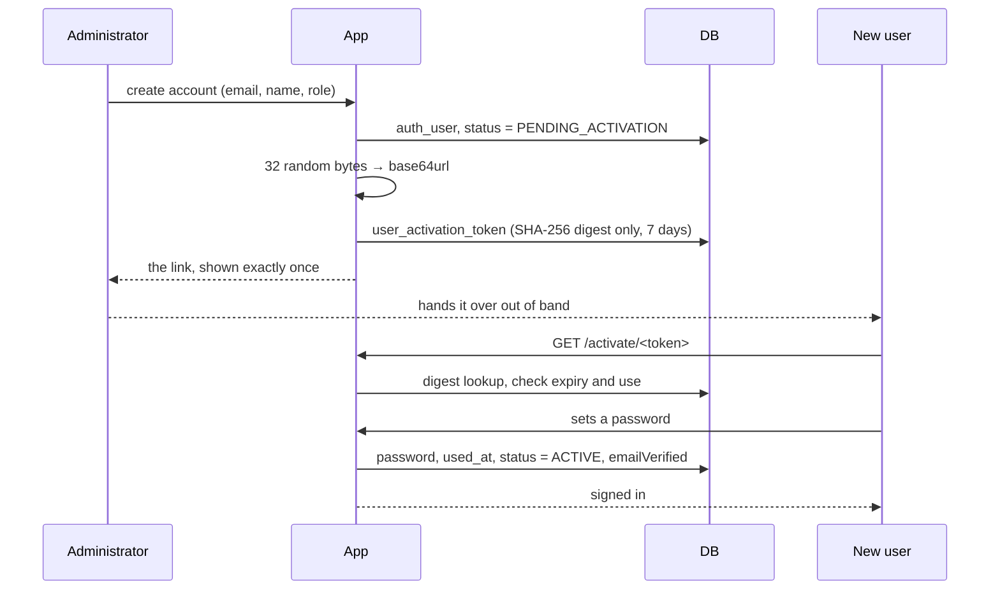

# Authentication

Better Auth 1.7, wrapped by `src/lib/auth/`. Nothing outside that directory
imports the library — an ESLint rule makes that an error — so a breaking upgrade
is one file's problem.

## No public sign-up

An administrator creates the account and hands over an activation link out of
band: Signal, Discord, in person. The application deliberately does not email
it. Accounts are created a few times a year, and a channel outside the system is
more reliable than a home SMTP relay for the one message that grants access.

An invalid link distinguishes _expired_, _already used_ and _not valid_, and
none of those answers reveals whether an account exists.

## Passwords

- argon2id, the library's default.
- Minimum 12 characters, checked against a list of the most common ones. No
  symbol requirements — NIST 800-63B is explicit that composition rules push
  people towards predictable patterns.
- The weak-password check normalises before comparing: trailing digits are
  stripped, then leet substitutions are undone. Doing those in the other order
  let four common passwords through, which is why there is a test for the order.
- Changing or resetting a password revokes every other session.

## Sessions

Database-backed, not JWT. The point is instant revocation: disabling an account
or changing a password has to take effect now, not when a token happens to
expire. Cookie is `httpOnly`, `secure`, `SameSite=Lax`, 30 days sliding, rotated
on sign-in.

## Rate limiting

Three layers, each answering a different question.

| Layer             | Keyed by           | Typical limit                                                                           |
| ----------------- | ------------------ | --------------------------------------------------------------------------------------- |
| Reverse proxy     | IP                 | operator's business                                                                     |
| Better Auth       | IP + path          | 3 per 10s on sign-in, 100 per minute generally                                          |
| `lib/throttle.ts` | scope + identifier | 10 sign-ins per 15 min per address; 5 resets per hour; 10 searches per hour per session |

The third exists because IP rotation is free and a target address is not. Its
counters live in MySQL rather than in process memory: an in-memory counter
resets on every deploy, which is precisely when a reset benefits an attacker.

Probed on a running deployment: fourteen sign-in attempts against one address
produce five answers and nine refusals.

## Password reset

`/forgot-password` answers identically whether or not the address exists. If it
does and the account is active, a token valid for one hour is emailed. Setting a
new password revokes every other session.

The reset endpoints are Better Auth's own, called from the browser through
`lib/auth/client.ts`; they are not Server Actions. That is the one place where
the authentication library's HTTP surface is used directly, and it is behind the
same `trustedOrigins` check as the rest of `/api/auth/*`.
