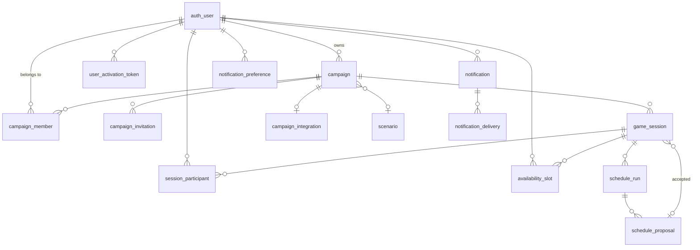

# Data model

MySQL 8.4, `utf8mb4` / `utf8mb4_0900_ai_ci`, server started with
`--default-time-zone=+00:00`. Every timestamp is UTC with millisecond precision;
the driver is configured `timezone: 'Z'` so no implicit conversion happens in
either direction.

Primary keys are `CHAR(26)` ULIDs. Sortable by creation time, so a clustered
index does not fragment the way random UUIDv4 keys make it —
[ADR-0010](../adr/0010-utc-instants-with-local-denormalization.md) covers the
time decisions, which are the ones that actually bite.

## Relationships

## Tables

### Identity

**`auth_user`** — owned by Better Auth, extended by us. Beyond the library's
columns it carries `status` (`PENDING_ACTIVATION` / `ACTIVE` / `DISABLED`),
`timezone` (IANA, default `Europe/Warsaw`), `locale`, and `deleted_at`.
`UNIQUE(email)`.

The `auth_` prefix exists because Better Auth's default table is called
`session` and this application's central noun is also a session. `game_session`
is the game; `auth_session` is a browser's.

**`auth_session`**, **`auth_account`**, **`auth_verification`** — the library's
own. Sessions live in the database rather than in a JWT so that disabling an
account or changing a password revokes access immediately.

**`auth_rate_limit`** — the library's IP-keyed limiter. **`identity_throttle`**
— ours, keyed by `<scope>:<identifier>`. Two tables because they answer
different questions: how many requests from this address, and how many attempts
against _this account from anywhere_. IP rotation is free; a target email is not.

**`user_activation_token`** — SHA-256 digest only, `expires_at`, `used_at`,
`created_by`. `UNIQUE(token_hash)`.

### Campaigns

**`campaign`** — name, description, `owner_id`, `scenario_id`, `status`
(`PLANNING` / `ACTIVE` / `ON_HIATUS` / `COMPLETED` / `ARCHIVED`), `timezone`,
default session length and quorum policy, `deleted_at`.

Archiving sets `status` and nothing else. It used to set `deleted_at` as well,
which made an archived campaign vanish and left `ARCHIVED` unobservable.

**`campaign_member`** — `role` (`KEEPER` / `INVESTIGATOR`), `status`
(`ACTIVE` / `LEFT` / `REMOVED`), `joined_at`, `left_at`.
**`UNIQUE(campaign_id, user_id)`** — rejoining updates the row rather than
inserting a second one, which is what preserves somebody's history across a
departure.

**`campaign_invitation`** — digest only, optional `target_user_id` (null means a
shared link), `role_on_join`, `max_uses`, `used_count`, `expires_at`,
`revoked_at`. The claim is a conditional `UPDATE … WHERE used_count < max_uses`,
so two people racing for the last seat produce exactly one member.

**`campaign_integration`** — one row per campaign per type. `config` is JSON
holding the webhook URL **encrypted with AES-256-GCM**; the plaintext is never
returned to the interface.

**`scenario`** — a name and a description. `campaign_id` is nullable so a shared
library is possible later without a migration.

### Sessions

**`game_session`** — the central table.

| Column                              | Note                                                                                                      |
| ----------------------------------- | --------------------------------------------------------------------------------------------------------- |
| `status`                            | `DRAFT` / `COLLECTING` / `PROPOSED` / `SCHEDULED` / `COMPLETED` / `CANCELLED`                             |
| `search_window_start` / `_end`      | local dates, inclusive                                                                                    |
| `grid_start_hour` / `grid_end_hour` | local hours; end exclusive; default 12–24                                                                 |
| `min_session_hours`                 | default 6                                                                                                 |
| `quorum`                            | counted against **players**, not participants — the Keeper is not one of the people quorum is about       |
| `availability_deadline`             | UTC; null means the Keeper closes it by hand                                                              |
| `timezone`                          | copied from the campaign at creation, so a later campaign change cannot reinterpret answers already given |
| `confirmed_start_utc` / `_end_utc`  | set when a date is agreed                                                                                 |
| `accepted_proposal_id`              | which ranked window was chosen, if any                                                                    |
| `set_manually`                      | whether the Keeper overrode the ranking                                                                   |

Indexed on `(campaign_id, status)` and `(status, availability_deadline)` — the
second is what the worker's deadline sweep reads.

**`session_participant`** — `priority` (`REQUIRED` / `PREFERRED` / `OPTIONAL`),
`is_keeper` (denormalised, because a campaign role can change after a session is
planned), `responded_at`, `attendance`.
**`UNIQUE(game_session_id, user_id)`**.

`responded_at` is set even when somebody answers "none of these". A deliberate
refusal and silence mean opposite things to a Keeper chasing replies.

### Availability

**`availability_slot`** — the highest-volume table: one row per person per hour
they answered for.

| Column                     | Note                                                 |
| -------------------------- | ---------------------------------------------------- |
| `slot_start_utc`           | the canonical key: the exact instant the hour begins |
| `local_date`, `local_hour` | denormalised for rendering and for debugging         |
| `state`                    | `YES` / `IF_NEED_BE` / `NO`; no row means no answer  |

**`UNIQUE(game_session_id, user_id, slot_start_utc)`** is the last line of
defence against a duplicated answer. Both time representations are kept
deliberately: the instant is unambiguous across daylight saving, and the local
pair lets the grid render without converting on every read. On the order of a thousand rows
per session at a month's window and six people.

### Scheduling

**`schedule_run`** — `algorithm_version`, `params` (a snapshot of what the run
was asked to solve), `triggered_by` (null means the deadline did it),
`candidate_count`, `rejection_summary`.

**`schedule_proposal`** — `rank`, `start_utc`, `end_utc`, `score DECIMAL(5,2)`,
and `breakdown` JSON holding per-participant quality plus the explanation.
`UNIQUE(schedule_run_id, start_utc)`.

Runs are kept rather than overwritten, which is what lets a proposal accepted
last month still be explained after the weights change.

### Notifications

**`notification`** — `user_id`, `type`, optional `campaign_id` and
`game_session_id`, `payload` JSON of facts (never a rendered sentence),
`read_at`.

**`notification_delivery`** — one row per channel per notification.
**`UNIQUE(notification_id, channel)`** is what makes redelivery after a restart
impossible rather than unlikely. `INDEX(status, next_attempt_at)` is the
worker's claim query.

**`notification_preference`** — only the exceptions are stored. A missing row
means the channel's default applies, so a channel added later reaches everybody
without a backfill.

### Operations

**`audit_log`** — `actor_id`, `action`, `entity_type`, `entity_id`, `metadata`,
`ip_address`.

**`worker_heartbeat`** — one row, updated after every job. The health endpoint
and the operations screen read it; a worker that dies quietly has no other
symptom.

## Migrations

Versioned SQL in `src/db/migrations/`, generated by `drizzle-kit generate` and
committed. Applied by a one-shot container before anything else starts. Never
`drizzle-kit push` against a deployment — see
[../operations/deployment.md](../operations/deployment.md) for the rules about
backwards compatibility.
