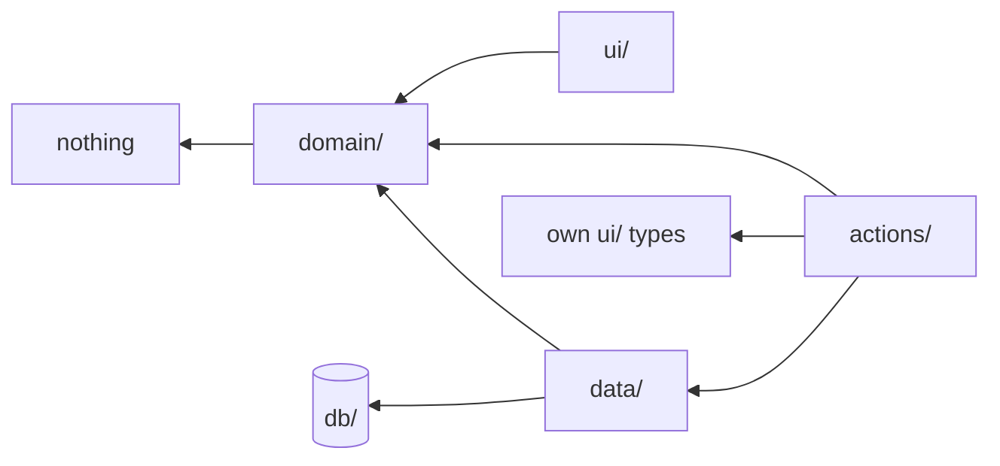
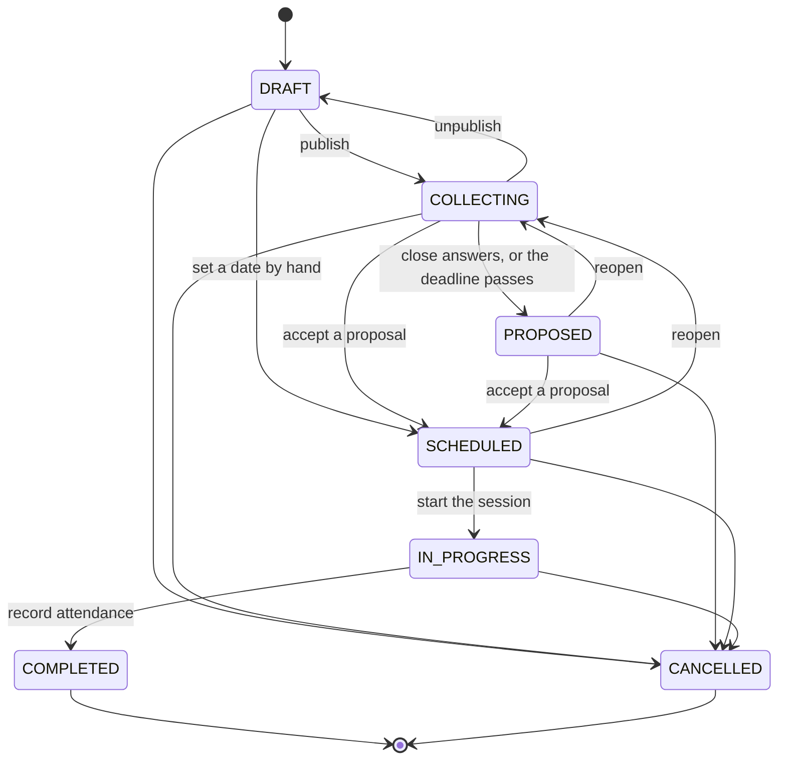

# Modules and boundaries

## The map

```
src/
├── app/                  routing only — thin files that call a query and render
│   ├── (auth)/           sign in, activate, forgot and reset password
│   ├── (app)/            campaigns, sessions, notifications, settings
│   ├── (admin)/          operations and accounts
│   ├── (dev)/            the design-system gallery, development only
│   └── api/              auth handler, health, worker health, calendar export
│
├── modules/              the domains
│   ├── identity/         accounts, activation, profile, administration
│   ├── campaigns/        campaigns, membership, invitations, scenarios
│   ├── sessions/         sessions, lifecycle, participants, calendar export
│   ├── availability/     answers, aggregation, the answering interface
│   ├── scheduling/       the ranking algorithm and its runs
│   ├── investigators/    character creation, rules, sheets, access and history
│   ├── notifications/    outbox, dispatchers, preferences, integrations
│   └── operations/       the deployment's own health
│
├── db/                   schema, client, migrations, seeds
├── lib/                  cross-cutting: auth wrapper, errors, mail, time, logging
├── components/           ui primitives and composed patterns
├── design-system/        tokens, global styles, contrast checks
├── stores/ui/            Zustand, interface state only
└── worker/               the background process and its jobs
```

Every module has the same four layers, and not every module needs all of them.

| Layer      | Holds                                                           | Never                                       |
| ---------- | --------------------------------------------------------------- | ------------------------------------------- |
| `domain/`  | rules, types, pure functions, Zod schemas                       | I/O, framework, database, clock, randomness |
| `data/`    | queries, mutations, authorization, DTO mapping                  | business rules                              |
| `actions/` | orchestration: validate → authorize → domain → write → announce | calculation                                 |
| `ui/`      | rendering and interaction                                       | business rules                              |

## The dependency rule



Read it as "points at what it is allowed to know about". `domain/` knows
nothing — that is what makes the scheduling algorithm testable without a
database and the availability rules testable without a browser.

## Enforcement

The rules above are not a convention. They are ESLint errors, and a violation
fails the build:

```js
// eslint.config.mjs
{ target: './src/modules/*/domain', from: './src/modules/*/data' },
{ target: './src/modules/*/domain', from: './src/db' },
{ target: './src/modules/*/data',   from: './src/modules/*/actions' },
{ target: './src/db',               from: './src/modules' },
```

plus, inside `domain/` only:

- no imports of React, Next, Drizzle, mysql2, Better Auth, `server-only`, node
  built-ins, `@/db`, `@/lib/auth`, or any other module's `data`/`actions`/`ui`;
- no `new Date()` with no arguments, no `Date.now()`, no `Math.random()`.

The clock rule is narrow on purpose: `new Date(isoString)` is parsing, not
reading a clock, and banning it forced the opposite of what the rule is for.

Two mechanisms are used together because they catch different things.
`no-restricted-paths` understands resolved files and catches relative imports;
`no-restricted-imports` works on the specifier text and fires even on a module
that does not exist yet.

## Crossing module lines

A module may import another module's `domain/` — that is how `scheduling`
reuses `SlotState` from `availability` and `ParticipantPriority` from
`sessions`, rather than declaring a second copy that drifts.

A module may also call another module's `data/` when the call is a guard or a
plain read: `availability/data` calls `requireSessionMember` from
`sessions/data/guards`, and `worker` jobs call `sessions/data/session-store`.
What no module does is reach into another's `actions/`.

### Guarded reads versus plain persistence

Two modules split their data layer in half, and the reason is worth knowing
before you add a third:

| Module          | Guarded (`requireX` inside) | Plain                   |
| --------------- | --------------------------- | ----------------------- |
| `sessions`      | `data/sessions.ts`          | `data/session-store.ts` |
| `scheduling`    | `data/view.ts`              | `data/runs.ts`          |
| `notifications` | `data/inbox.ts`             | `data/notifications.ts` |

The worker closes deadlines and raises notifications in a process with no
session and no request. If those writes lived beside a function that calls
`requireUser`, the worker's bundle would contain the entire authentication
stack — and would execute its module-level side effects — to do something that
has nobody to authenticate. The split keeps the worker bundle at 1.2 MB and free
of Better Auth and Next.

## Session state machine



The table lives in `sessions/domain/lifecycle.ts` as data, not as a chain of
conditionals, and every one of the 49 status pairs is covered by a test.
`COMPLETED` and `CANCELLED` are terminal: a session that already happened is a
historical record, and reviving a cancelled one would resurrect notifications
people already acted on.

`IN_PROGRESS` is entered by hand rather than by the clock. It is the moment the
Keeper says the evening has begun, which is what fixes who is playing which
Investigator; starting on the confirmed hour would freeze sheets while people
are still arriving. Starting is refused while anybody marked as playing a
character has not been given one.

Changing the date of a session that already has one is **not** a transition —
`SCHEDULED → SCHEDULED` is not in the table. It goes through `canSetDate`,
because moving a session is a change of _when_, not of _state_.

## Two kinds of Investigator history

A character sheet is read by four audiences that must not be served from the same
place: its owner, the Keeper of a campaign it is linked to, the other players,
and somebody whose access has ended.

`investigators/domain/visibility.ts` holds the field registry and the cascade
that hides a calculated value whose source is hidden. `domain/sheet.ts` turns a
sheet plus that map plus a reader's role into the one value that reader may see,
and `data/` applies it before anything is returned. Nothing is hidden in a
component: a value that reached the browser has already been disclosed.

History is two tables and the difference matters.

- **Snapshots** are the character as it was, with the privacy settings that were
  in force over it. They are written at session start, at transfer, and before
  access is reduced, and they are never served to a reader directly.
- **Disclosure snapshots** are what one person had been shown, captured at the
  moment their access ended. They are what makes the product's promise hold: a
  Keeper keeps the sheets of a campaign that finished, and a player keeps what
  they were shown by somebody who has since made it private.

Both are append-only. A history that can be revised is not one.

One person can hold several disclosures of the same character, and the newest is
not always the richest: hiding a field captures one while everybody keeps their
access, and a later capture taken when they leave the campaign records that
field as already hidden. `/investigators/kept/[id]` therefore lists the moments
somebody was shown a character rather than a single latest state, and the
snapshot identifier is filtered by viewer inside the query — a capture taken for
somebody else cannot be read by passing its id.

Anything computed _from_ a snapshot is projected first. A session's
before-and-after summary compares the pair of snapshots that evening took, with
the reader's own role applied to both, because comparing the stored sheets would
publish what the live sheet withholds.

## Adding a module

See [../development/adding-a-module.md](../development/adding-a-module.md).
