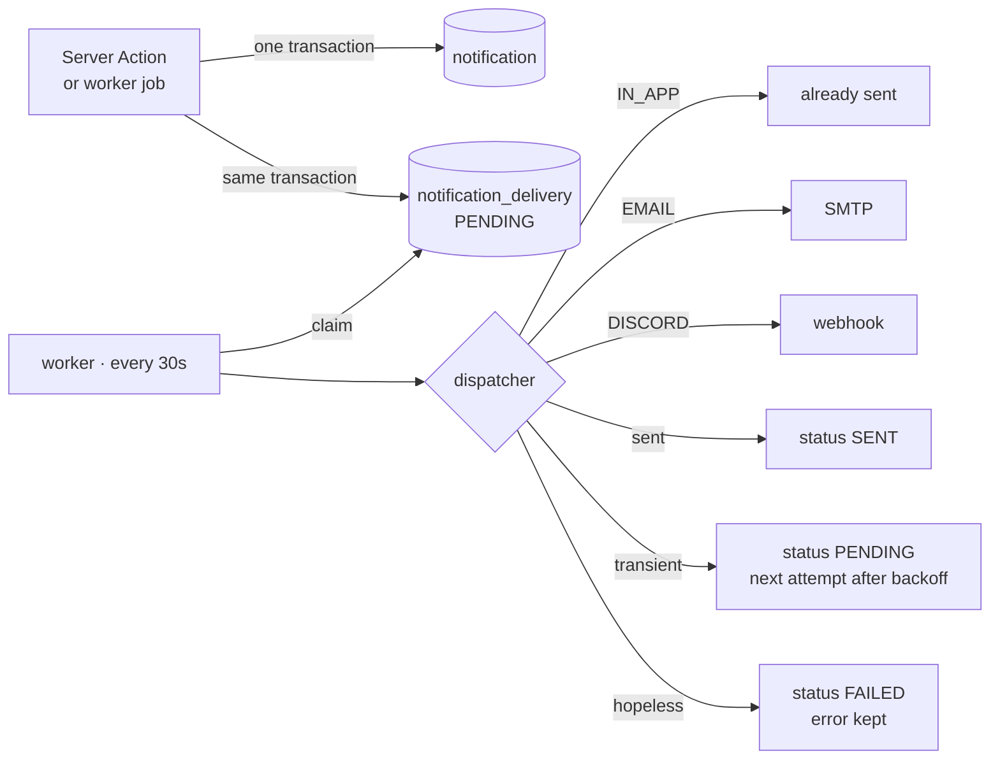

# Notifications

## Two things, deliberately separate

A **notification** is an event that happened to somebody, stored once. A
**delivery** is an attempt to carry it somewhere, and there are zero or more per
notification.

The split is the point. A relay that was down for an hour is not a reason for
somebody to never learn their session moved: the record is in the application
regardless, and delivery is best-effort on top of it.

## The outbox

The event and the intention to deliver it are written **in the same transaction
as the change that caused them**. A crash between the two is not a state that
exists.



### Claiming

```sql
SELECT id FROM notification_delivery
WHERE next_attempt_at <= :now
  AND (status = 'PENDING'
       OR (status = 'SENDING' AND updated_at < :staleBefore))
ORDER BY next_attempt_at
LIMIT :n
FOR UPDATE SKIP LOCKED
```

`SKIP LOCKED` is the one primitive that makes a table a good enough queue: a
second worker takes different rows instead of blocking on the first one's. The
claim and the flip to `SENDING` are one transaction; the network call happens
after it closes, because holding row locks for the length of an SMTP
conversation is how a queue becomes a deadlock.

A row left `SENDING` by a killed process is reclaimed after ten minutes —
longer than any plausible send, short enough that a worker killed mid-flush does
not strand its messages for the evening.

`UNIQUE(notification_id, channel)` is what makes redelivery after a restart
impossible rather than unlikely. There is an integration test that asserts the
constraint directly.

### Retrying

Five attempts at 1 minute, 5, 15, 1 hour, 4 hours. Spread rather than tight: a
home relay that is down is usually down for minutes, and hammering it makes the
queue busy without making the mail arrive. After that the delivery is `FAILED`
and kept — a failed delivery is the only evidence that somebody was not told,
and the operations screen reads it.

A failure is classified by the dispatcher, not guessed by the queue: a timeout
is retryable, a 404 from a deleted webhook is not.

## Channels

| Channel   | Behaviour                                                                                                                                                            |
| --------- | -------------------------------------------------------------------------------------------------------------------------------------------------------------------- |
| `IN_APP`  | The record _is_ the delivery. Written as `SENT` immediately, not queued. Cannot be switched off — that would leave somebody unable to find out what happened at all. |
| `EMAIL`   | Plain text plus, for a confirmed, moved or cancelled session, a calendar attachment. On unless the person turns it off.                                              |
| `DISCORD` | Campaign-level facts only, **once per event**.                                                                                                                       |

### One Discord post, not six

A channel is a room, not six inboxes. When an event reaches several people, one
recipient's notification carries the Discord delivery — chosen by lowest user id
so the choice is deterministic and does not move when the same event fires
again. The wording for a channel is written separately from the wording for a
person: a post saying "you have not answered" is addressed to nobody and read by
everybody.

Broadcast types are availability requested, session scheduled, rescheduled and
cancelled, a member joining, and a campaign having nothing planned. Invitations
and personal reminders are not.

The Discord delivery is **not** gated on the carrier's own preferences: the post
belongs to the campaign, and one person muting their email should not silence
the room.

## Wording

`notifications/domain/messages.ts` turns a payload of facts into sentences.
Nothing upstream ever stores a rendered string — a stored sentence cannot be
re-read in another zone or another language.

Every type produces a subject, a body addressed to a person, a `channelText`
addressed to a room, and a link. Tests assert three properties across all ten
types: each says something, none addresses a room as a person, and each carries
a link somebody can act on.

## Preferences

Only exceptions are stored. A missing row means the channel's default applies,
so a channel added later reaches everybody without a backfill and somebody who
has never opened the settings page is not silently opted out of something that
did not exist when they last looked.

## Scheduled jobs

| Job               | Interval        | What it does                                                               |
| ----------------- | --------------- | -------------------------------------------------------------------------- |
| `flush-outbox`    | 30s             | Claims up to 25 due deliveries and sends them one at a time                |
| `close-deadlines` | 5 min           | Closes sessions whose deadline passed, ranks the answers, tells the Keeper |
| `send-reminders`  | 15 min          | One nudge per person per session, 36 hours before the deadline             |
| `idle-campaigns`  | daily 08:00 UTC | Tells Keepers when a campaign has nothing planned, weekly at most          |
| `cleanup`         | daily 03:00 UTC | Expired activation tokens, invitations, stale throttle counters            |

Every job runs inside a boundary that logs and returns rather than throws:
croner would otherwise stop rescheduling a pattern whose handler rejects, and
the failure would look like a job that simply never runs again. Each run leaves
a heartbeat behind, so "the worker is alive" means work is being done rather
than that a process exists.

Deliveries are sent sequentially. The volume is a handful of messages after
somebody presses a button, and a home SMTP relay reacts badly to a burst of
simultaneous connections.

### Idempotency of the nudges

Neither reminder job carries a flag on the thing it is nudging about. They ask
the notification table whether this person has already been told about this
session — a question the record already answers, and one that stays correct when
a deadline moves.

## Calendar attachments

`sessions/domain/ics.ts` builds RFC 5545 output. Three details that break real
clients silently and are therefore tested: CRLF line endings, escaping of
commas, semicolons, backslashes and newlines, and folding at 75 **octets** —
counting characters splits a multi-byte character in half, which is reachable
with any Polish name.

The UID is stable for the life of the session, so a moved session replaces the
entry instead of appearing beside it.
