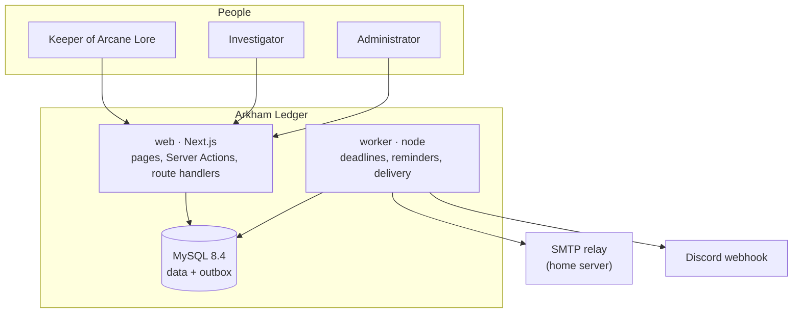
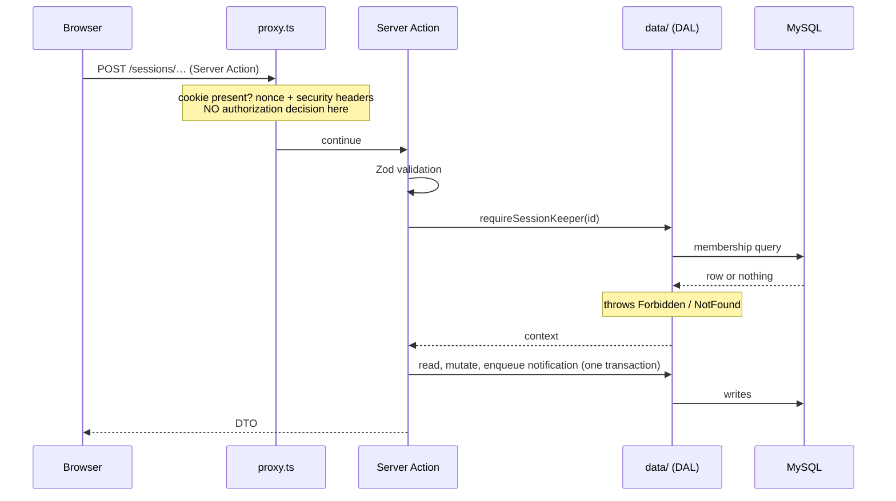

# Overview

## The problem

A dozen people in several independent parties play Call of Cthulhu. The
bottleneck is not running the game, it is agreeing on an evening. Before this
existed the job was done with a poll, a chat channel and somebody's memory, and
it failed in the same way every time: the poll answers what everybody _could_
do, nobody works out what that means, and the next session drifts.

Two kinds of tool exist and neither closes the gap. Campaign managers build
calendars for the _world_ — invented months, moons, seasons — and have ignored
player availability for a decade. Generic polls have good grids and no idea what
a Keeper is, what a quorum is, or that a session needs six unbroken hours. Both
leave the question _can we actually play_ to a human.

This application answers that question.

## Shape

A modular monolith: one Next.js application, one background worker, one MySQL
database. No message broker, no second data store, no services to keep in step.
At this size the cost of a distributed system is paid in operations and bought
nothing — see [ADR-0001](../adr/0001-modular-monolith.md) and
[ADR-0008](../adr/0008-mysql-queue-instead-of-redis.md).

The worker is a separate process rather than a timer inside the web tier for one
reason: cron inside the application runs once per replica, so every reminder
would be sent as many times as the application is scaled. It shares the image
with the web tier so the two cannot drift apart.

## Containers

| Container | Entry point                   | Responsibility                                       |
| --------- | ----------------------------- | ---------------------------------------------------- |
| `db`      | `mysql:8.4`                   | Everything persistent, including the delivery queue  |
| `migrate` | `node dist-worker/migrate.js` | One-shot; must exit zero before anything else starts |
| `web`     | `node server.js` (standalone) | Rendering, Server Actions, route handlers            |
| `worker`  | `node dist-worker/worker.js`  | Scheduled jobs and outbound delivery                 |

`migrate` running first is what stops new code meeting an old schema. Both
`web` and `worker` depend on it completing successfully.

## Request path

The proxy is user experience, not security. The real boundary is the data access
layer, which re-verifies on every call — see
[authorization.md](authorization.md) and
[ADR-0003](../adr/0003-better-auth-and-dal-boundary.md).

## Technology, and why

| Choice                                    | Reason                                                                                                                              |
| ----------------------------------------- | ----------------------------------------------------------------------------------------------------------------------------------- |
| Next.js 16, App Router, standalone output | Server Components by default; one deployable artifact                                                                               |
| Server Actions instead of REST            | One consumer, end-to-end types, no generated client                                                                                 |
| Drizzle ORM                               | Schema in TypeScript, SQL stays visible, native Better Auth adapter ([ADR-0002](../adr/0002-drizzle-over-sequelize.md))             |
| MySQL 8.4                                 | `FOR UPDATE SKIP LOCKED` makes a table a good enough queue                                                                          |
| Better Auth behind a port                 | Database sessions, revocable instantly; wrapped so a breaking upgrade touches one file                                              |
| Base UI primitives, own design system     | Behaviour and accessibility from the primitive, appearance entirely ours ([ADR-0007](../adr/0007-base-ui-over-radix-primitives.md)) |
| Temporal (polyfill)                       | Daylight saving handled where slots are generated, once                                                                             |
| Vitest + Testcontainers                   | Unit tests fast enough to run on save; integration tests against real MySQL                                                         |

## What is deliberately absent

- **No Redis.** The queue is a table with `SKIP LOCKED`.
- **No public sign-up.** An administrator creates accounts and hands over an
  activation link out of band.
- **No file uploads.** Scenario PDFs are a later module; the storage port is
  described in [extension-points.md](extension-points.md) so that when it lands
  it is a new file rather than a refactor.
- **No metrics stack.** A handful of counts on an operations screen answers
  every question this deployment is asked.
- **No multi-tenancy.** One instance, one group.

## Where to go next

- [modules.md](modules.md) — the boundaries and the rules that hold them
- [data-model.md](data-model.md) — every table and why it is shaped that way
- [scheduling.md](scheduling.md) — the algorithm, with the worked example
- [availability.md](availability.md) — time, zones, and the two days a year that break everything
