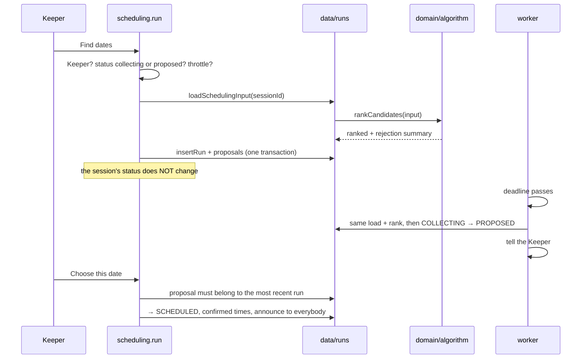

# Scheduling

The algorithm lives in `modules/scheduling/domain/`. It is pure: no clock, no
database, no randomness, no dependence on the order participants arrive in. The
same answers always produce the same ranking, which is what makes a proposal
something a Keeper can defend at the table.

## What it is given

It never sees a date or a time zone. The caller hands it the grid as an ordered
list of hours, each already resolved to the instant it begins:

```ts
type SchedulingSlot = {
  readonly startUtc: string // ISO 8601 with Z; sorts chronologically
  readonly endUtc: string // supplied, so the domain does no time arithmetic
  readonly localDate: string
  readonly localHour: number
}
```

Everything it decides is counted in slots. A 25-hour night simply arrives with
25 of them, and six consecutive slots are six real hours on every day of the
year.

Each participant carries their priority, whether they are a Keeper, whether they
answered at all, and a map from slot instant to state.

## Candidates

A candidate is a start hour on one day. Its **core** is the first
`minSessionHours` slots from that start:

```
for each local day in the window:
    for each start where start + minSessionHours ≤ hours available that day:
        core = slots[start … start + minSessionHours)
```

At the default 12:00–24:00 grid with six hours minimum, that is seven start
hours a day. A ninety-day search — the widest a Keeper may ask for — is about
630 candidates, each costing `participants × hours`. The whole thing runs in
well under 50 ms, which is why this is a brute-force search and not a solver
([ADR-0009](../adr/0009-weighted-scoring-over-csp-solver.md)).

## Hard constraints

A window that breaks one of these is not a worse date, it is not a date:

1. **Every Keeper** is available for the whole core.
2. **Every `REQUIRED` participant** is available for the whole core.
3. **Enough players are available to reach quorum.**

Quorum counts **players**, not participants. The Keeper has to be there for the
session to exist at all, so counting them would let a threshold of three be met
by two players.

Rejections are recorded with a reason and, where there is one, a person. That is
not diagnostics for its own sake: when nothing qualifies, it is the only thing
the Keeper can act on.

## Quality: the weakest hour

```
stateValue:  YES → 1.0   IF_NEED_BE → 0.6   NO → 0   no answer → 0

quality(participant, core) = min(stateValue(participant, hour) for hour in core)
```

The minimum, not the mean. A session is not divisible: somebody free for five
hours of a six-hour session cannot attend it, and averaging would admit them at
0.83 and quietly build the evening around a person who leaves before the end.

Silence scores the same as a refusal. Scoring an unanswered hour above zero
would let a date be chosen on the strength of people who never replied — the
exact failure the tool exists to prevent. The Keeper is told separately how many
have not answered, and a non-responder is never _named_ as unable to come.

## Score

```
weight:  REQUIRED → 5   PREFERRED → 3   OPTIONAL → 1

score = round(100 × Σ weight(p) × quality(p) / Σ weight(p), 2)   for non-Keepers
```

Keepers are excluded: their availability is already a hard constraint, so
including them would add a term identical for every surviving window and
compress the range for no information.

`REQUIRED` carries a weight even though its availability is mandatory — without
one, a required player being free _at a push_ rather than firmly free would not
move the ranking, and it should.

A session with nobody but its Keeper scores 100 rather than dividing by nothing.

Rounding happens before ranking, not only on display: 0.6 × 3 is not exactly 1.8
in binary floating point, and two windows equal to the eye would otherwise be
ordered by a difference of 1e-15 and skip the tie-breakers meant to decide them.

## Extending the evening

After the constraints pass, the end is pushed out for as long as **the people
who have to be there** stay available — Keepers and `REQUIRED` participants.
An optional player going home early does not end the session. The walk stops at
the end of the grid, so an evening never spills into the next day.

## Tie-breakers

In order, all deterministic:

1. higher score
2. more participants firmly free rather than free at a push
3. longer evening
4. fewer unknowns — less being guessed
5. earlier instant

The last one subsumes "earlier day, then earlier hour": instants sort
chronologically as strings.

## Worked example

Grid 16:00–24:00, six hours minimum, quorum two. Marek runs the game, Anna is
required, Piotr and Kasia preferred, Tomek optional.

|                   | Thu 8              | Fri 9              | Wed 7       |
| ----------------- | ------------------ | ------------------ | ----------- |
| Marek (Keeper)    | `YES` 16–24        | `YES` 18–24        | `YES` 16–24 |
| Anna (REQUIRED)   | `YES` 17–24        | `IF_NEED_BE` 18–24 | `NO`        |
| Piotr (PREFERRED) | `YES` 16–24        | `YES` 18–24        | `YES` 16–24 |
| Kasia (PREFERRED) | `IF_NEED_BE` 18–24 | `NO`               | `YES` 16–24 |
| Tomek (OPTIONAL)  | `YES` 18–24        | `YES` 18–24        | `YES` 16–24 |

```
Thu 18:00   5×1.0 + 3×1.0 + 3×0.6 + 1×1.0 = 10.8 / 12 = 90.00
Thu 17:00   5×1.0 + 3×1.0 + 0     + 0     =  8.0 / 12 = 66.67   (Kasia and Tomek arrive at 18)
Fri 18:00   5×0.6 + 3×1.0 + 0     + 1×1.0 =  7.0 / 12 = 58.33
Wed  any    rejected — Anna is required and cannot make it
```

Those three numbers are asserted exactly in
`tests/unit/scheduling/worked-example.test.ts`. They were worked out on paper
before the algorithm existed, which is what makes the test a check rather than a
recording of current behaviour. If a weight changes, that file fails first, and
this document and `domain/constants.ts` have to move with it.

## What the Keeper sees

```
✦  Thursday 8 October, 18:00 – 24:00      6 hours              91.67%
   Everyone required is free · 2 of 2 preferred · 0 of 1 optional.
   ⚠ 1 person has not answered
   3 OF 4 PLAYERS FREE · QUORUM OF 2 MET              [Choose this date]

2. Sunday 11 October, 18:00 – 24:00       6 hours                 50%
   Everyone required can come · 1 of 2 preferred · 0 of 1 optional.
   ⚠ Only at a push: Anna Kowalska
   ⚠ Cannot make it: Józef Malinowski
```

"Met" means firmly free for the whole window, not merely able to come. A player
at a push counts towards quorum but is named in a note instead, because
reporting them as available is how a Keeper ends up surprised on the night.

## When nothing works

```
No date works for everyone who has to be there

All 49 possible evenings were ruled out. 48 because a Keeper is not free.
1 because too few players are free: the best any evening reached was 2 of the 3 needed.

  Eleanor Ashcroft rules out 48 of them.

WHAT CAN CHANGE
  · Search a wider range of dates.
  · Lower the quorum from 3 to 2.
  · Make Eleanor Ashcroft optional, or ask them to answer again.
  · Shorten the minimum length, or start earlier in the day.
```

Nobody having answered at all is reported as exactly that, rather than as the
Keeper being unavailable — technically true and useless, since the remedy is
completely different.

## Running and confirming



**Searching does not change the session's status.** A Keeper looking at the
state of play halfway through the week would otherwise close collection by
looking at it, and everybody who had not answered yet would find the grid locked
with no explanation. Closing is a separate, explicit action — or the deadline.

**Only a proposal from the most recent run may be accepted.** Answers change; a
Keeper clicking a card from an hour-old list would otherwise confirm a date the
current answers no longer support, without anything on screen saying so.

## Versioning

`ALGORITHM_VERSION` is stamped on every run. Bump it whenever weights, hard
constraints or tie-breakers change: an old proposal stays explainable because
the run records which rules produced it.
