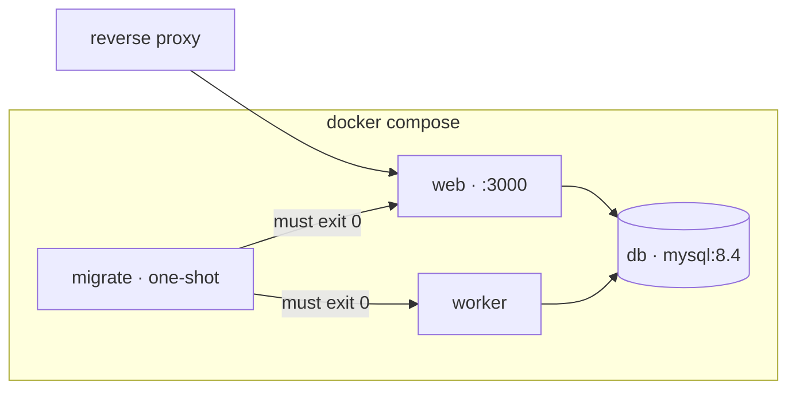

# Deployment

One server, Docker Compose, built on the machine it runs on.

## The shape



`migrate` runs to completion before `web` and `worker` start. That ordering is
what stops new code meeting an old schema.

## Deploying

```bash
scripts/deploy.sh
```

which does, in order: back up, build both images, run migrations as a one-shot
container that must exit zero, start web and worker, and wait on both health
checks. If the web check does not come good it puts the previous image back.

It does **not** roll the database back. Between the migration and the failure
somebody may have written something, and a script that silently discards that
turns a bad deploy into data loss. The command to restore by hand is printed
instead.

```bash
DEPLOY_PULL=1 scripts/deploy.sh    # git pull --ff-only first
SKIP_BACKUP=1 scripts/deploy.sh    # only when there is nothing to lose
```

### By hand

```bash
git pull --ff-only
scripts/backup.sh predeploy
docker compose -f docker-compose.yml -f docker-compose.prod.yml build
docker compose -f docker-compose.yml -f docker-compose.prod.yml run --rm migrate
docker compose -f docker-compose.yml -f docker-compose.prod.yml up -d web worker
curl -fsS http://127.0.0.1:3000/api/health
curl -fsS http://127.0.0.1:3000/api/health/worker
```

## Migrations

Five rules, each of which exists because breaking it hurts:

1. **Generated, committed, reviewed.** `npm run db:generate` after a schema
   change. Never `drizzle-kit push` against a deployment.
2. **Backwards compatible in one direction at a time.** A new column arrives
   nullable, is backfilled, and only becomes `NOT NULL` in a later deploy.
3. **Never drop a column in the same deploy that stops using it.** That is what
   makes rolling the code back possible.
4. **Tested against a copy of production data**, not against an empty schema.
5. **Before the new code**, always.

## Rolling back

| What went wrong                | What to do                                                                                   |
| ------------------------------ | -------------------------------------------------------------------------------------------- |
| Bad code, migration compatible | `docker compose up -d` with the previous image — `deploy.sh` does this automatically         |
| Bad migration                  | Restore the pre-deploy dump, then the previous image. By hand, deliberately                  |
| Container crash-looping        | `restart: unless-stopped` plus the health check will keep trying; read `docker compose logs` |

## The build

Two artifacts from one image:

- **web** — Next.js `output: standalone`, run as `node server.js`.
- **worker and migrator** — bundled by esbuild into single files run by plain
  `node`. They cannot run from source in the runtime image, because standalone
  ships only a traced subset of `node_modules`. See
  [ADR-0012](../adr/0012-bundled-worker-and-split-data-layer.md).

`mysql2`, `pino` and `nodemailer` are external to that bundle and resolve from
the standalone `node_modules` — which carries them because
`serverExternalPackages` in `next.config.ts` says so. Removing that setting
breaks the worker in a way no test catches.

## Health

| Endpoint             | Green                            | Red |
| -------------------- | -------------------------------- | --- |
| `/api/health`        | database reachable               | 503 |
| `/api/health/worker` | heartbeat under five minutes old | 503 |

`scripts/health-watch.sh` on the host's cron watches both and mails the
administrator after three consecutive failures. Three, not one: a restart during
a deploy is not an incident, and an alert that cries wolf is an alert people
filter.

```cron
*/5 * * * *  /srv/arkham/scripts/health-watch.sh
0   3 * * *  /srv/arkham/scripts/backup.sh daily
0   4 * * 0  /srv/arkham/scripts/backup.sh weekly
0   5 1 * *  /srv/arkham/scripts/backup.sh monthly
0   6 * * 1  /srv/arkham/scripts/verify-restore.sh
```

## Reverse proxy

The proxy must:

- forward `X-Forwarded-Host` and `X-Forwarded-Proto`, or Server Actions refuse
  every request as a cross-origin one;
- **strip `x-middleware-subrequest`** on the way in, regardless of the Next.js
  version;
- terminate TLS, which is also what makes `secure` session cookies work.

`ALLOWED_ORIGINS` must name every public origin.
